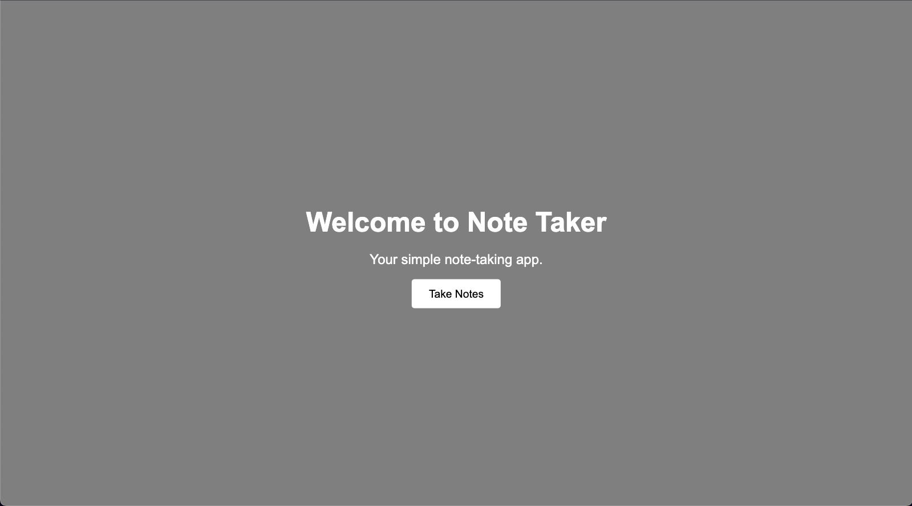
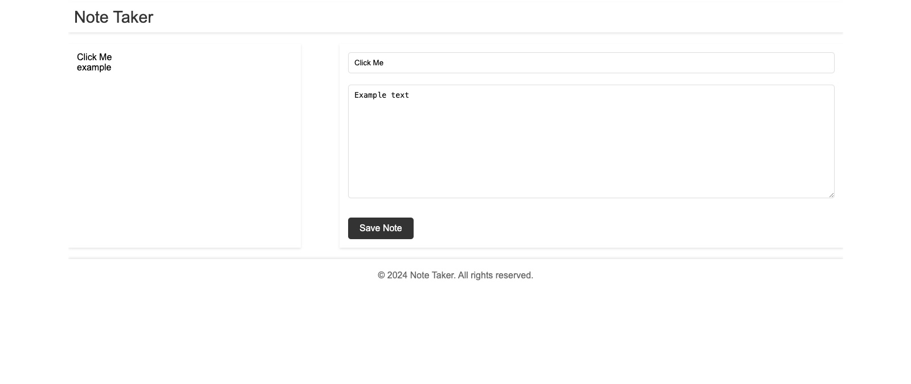

# Challenge-Week-11
A Note Taker application that can be used to write and save notes. This application will use an Express.js back end and will save and retrieve note data from a JSON file.

# Note Taker Application

## Description

The Note Taker is a web application that allows users to write, save, and manage their notes efficiently. Built with a clean and user-friendly interface, it helps users keep track of tasks and organize thoughts in a seamless manner. Utilizing Express.js for the backend, the application serves static files for the front end and handles data persistence by storing notes in a JSON file.

## Features

- Create and save new notes
- View previously saved notes
- Delete notes no longer needed
- Responsively designed UI for desktop and mobile browsers

## Technologies Used

- HTML
- CSS
- JavaScript
- Node.js
- Express.js

## Installation

To run the Note Taker application locally, you'll need to have Node.js installed on your system.

1. Clone the repository: git clone https://github.com/ImNeeeks/note-taker
2. Install the necessary node packages: npm install
3. Start the application: node server.js

## Usage

After installation, open your browser and go to `http://localhost:3001` to start using the Note Taker. The homepage presents you with a simple and clear option to go to the notes page where you can manage your notes.

## Contributing

N/A

## License

This project is licensed under the [MIT License](LICENSE).

## Repository

- [GitHub Repository](https://github.com/ImNeeeks/note-taker)

## Demo

For a live demo of the application, visit the following link: [Note Taker Live Demo](#) (You'll need to replace this with the actual link to your live app, if available)

## Screenshots

---